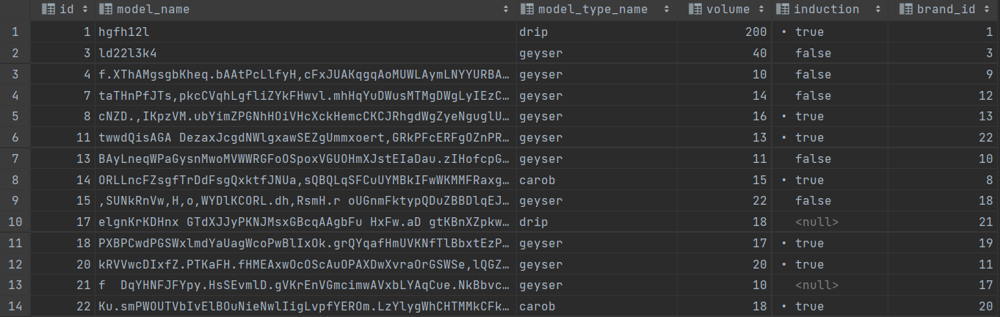
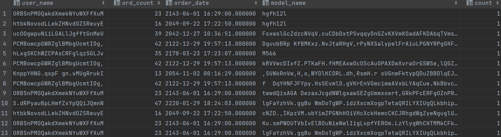

**Язык SQL DML**

**Цели работы**
Познакомить студентов с языком создания запросов управления данными SQL-DML.

**Программа работы**


1. Изучение SQL-DML.
2. Выполнение всех запросов из списка стандартных запросов. Демонстрация результатов преподавателю.
3. Получение у преподавателя и реализация SQL-запросов в соответствии с индивидуальным заданием. Демонстрация результатов преподавателю.
4. Сохранение в БД выполненных запросов SELECT в виде представлений, запросов INSERT, UPDATE или DELETE -- в виде ХП. Выкладывание скрипта в GitLab.

**Список стандартных запросов**

1. Сделайте выборку всех данных из каждой таблицы
2. Сделайте выборку данных из одной таблицы при нескольких условиях, с использованием логических операций, LIKE, BETWEEN, IN (не менее 3-х разных примеров)
3. Создайте в запросе вычисляемое поле
4. Сделайте выборку всех данных с сортировкой по нескольким полям
5. Создайте запрос, вычисляющий несколько совокупных характеристик таблиц
6. Сделайте выборку данных из связанных таблиц (не менее двух примеров)
7. Создайте запрос, рассчитывающий совокупную характеристику с использованием группировки, наложите ограничение на результат группировки
8. Придумайте и реализуйте пример использования вложенного запроса
9. С помощью оператора INSERT добавьте в каждую таблицу по одной записи
10. С помощью оператора UPDATE измените значения нескольких полей у всех записей, отвечающих заданному условию
11. С помощью оператора DELETE удалите запись, имеющую максимальное (минимальное) значение некоторой совокупной характеристики

    С помощью оператора DELETE удалите записи в главной таблице, на которые не ссылается подчиненная таблица (используя вложенный запрос)

**Ход работы**

**Data Manipulation Language (DML)** – это группа операторов для манипуляции данными. С помощью этих операторов мы можем добавлять, изменять, удалять и выгружать данные из базы, т.е. манипулировать ими.

#### Оператор выбора `SELECT`

Этот оператор возвращает ни одного, одно или множество строк, удовлетворяющих указанному условию и упорядоченных по заданному критерию. 

Полный синтаксис оператора `SELECT` имеет вид:
```
SELECT [ALL | DISTINCT] <список_выбора>
FROM <имя_таблицы>, ...
[ WHERE <условие> ]
[ GROUP BY <имя_столбца>,... ]
[ HAVING <условие> ]
[ ORDER BY <имя_столбца> [ASC | DESC],... ]
```
В квадратных скобках приведены необязательные части оператора `SELECT`. Порядок предложений в операторе `SELECT` должен строго соблюдаться:

* `SELECT <список_выбора>` -- поля таблицы значения из которых нужно выбрать (`*` - дает все поля таблицы)
* `FROM <имя_таблицы>` -- имя таблицы, из которой выбираются данные
* `WHERE <условие>` -- условие отбора (выбираются только записи, которые ему соответствуют)
* `GROUP BY <имя_столбца>[, <имя_столбца> ...]` -- определяет условие группировки
* `HAVING <условие>` -- накладывает ограничения на результаты группировки
* `ORDER BY <имя_столбца>` -- определяет по каким полям будут упорядочиваться возвращаемые записи
* `ASC | DESC` -- указывают, как сортировать по возрастанию или по убыванию

Оператор `SELECT` позволяет возвращать не только множество значений полей, но и некоторые совокупные (агрегированные) характеристики, подсчитанные по всем или по указанным записям таблицы. В SQL определены следующие агрегатные функции:
* `AVG (<имя поля>)` -- среднее по всем значениям данного поля
* `SUM (<имя поля>)` -- сумма всех значений данного поля
* `MAX (<имя поля>)` -- максимальное из всех значений данного поля
* `MIN (<имя поля>)` -- минимальное из всех значений данного поля
* `COUNT (<имя поля>)` или `COUNT (*)` -- число записей

#### Оператор `INSERT`

Добавление записей осуществляется с помощью оператора `INSERT`:
```
INSERT INTO <имя_таблицы> [ (<имя_поля>, ...) ] VALUES (<значение>, ...)
```
Производится добавление одной записи в указанную таблицу `<имя_таблицы>` и заносятся значения для выбранных полей. 
Если имена полей не указаны, то значения заносятся во все поля таблицы. Набор полей должен быть согласован с набором заносимых значений. 
Для остальных полей заносятся значения определенные по умолчанию, а если таковых не имеется то в них записывается `NULL`.

#### Оператор `DELETE`

Удаление одной или нескольких записей осуществляется с помощью оператора `DELETE`:
```
DELETE FROM <имя_таблицы> [ WHERE <условие> ]
```
Удаляются все записи, удовлетворяющие указанному условию. Если ключевое слово `WHERE` и условие отсутствуют, из таблицы удаляются все записи.

#### Оператор `UPDATE`

Модификация записей осуществляется оператором `UPDATE`:
```
UPDATE <имя_таблицы>
SET <имя_столбца> = <значение>, ...
[WHERE <условие>]
```
Для заданной таблицы изменяются значения указанных в операторе столбцов. 
Если задано ключевое слово `WHERE` и условие, то оператор `UPDATE` применяется только к тем записям, для которых оно выполняется. 
Если условие не задано, `UPDATE` применяется ко всем записям.

Все запросы можно увидеть в файле 
Результаты сохранены в картинках.
В задании 1 мы выводим все записи всех таблиц 


В задании 2 нужно было сделать выборку данных из одной таблицы при нескольких условиях, с использованием логических операций, LIKE, BETWEEN, IN (не менее 3-х разных примеров)
```sql
CREATE OR REPLACE VIEW task2_1 AS
SELECT * FROM models
WHERE model_type_name::text LIKE '%drip' AND id != 3;

SELECT * FROM task2_1;

CREATE OR REPLACE VIEW task2_2 AS
SELECT * FROM models
WHERE volume BETWEEN 10 AND 200 AND id != 2;

SELECT * FROM task2_2;

CREATE OR REPLACE VIEW task2_3 AS
SELECT br.name, company_name, link
FROM models
    JOIN brands br ON br.id = models.brand_id
WHERE induction IN (true, false, null);

SELECT * FROM task2_3;
```





В задании 3 создать в запросе вычисляемое поле.

```sql
CREATE OR REPLACE VIEW task3 AS
SELECT AVG(count) AS avarage_count
FROM supplier
WHERE id/2 = 0;

SELECT * FROM task3;
```


В 4 создание выборки всех данных с сортировкой по нескольким полям.

```sql
CREATE OR REPLACE VIEW task4_1 AS
SELECT name, count, last_date
FROM supplier
ORDER BY count, last_date;

SELECT * FROM task4_1;

CREATE OR REPLACE VIEW task4_2 AS
SELECT name, count, last_date
FROM supplier
ORDER BY last_date, count;

SELECT * FROM task4_2;
```


В 5-ом создать запрос, вычисляющий несколько совокупных характеристик таблиц.

```sql
CREATE OR REPLACE VIEW task5 AS
SELECT COUNT(*) AS num_of_models, AVG(volume) AS avg_volume,
SUM(volume) AS sum_volume
FROM models
    JOIN products prod_id ON prod_id.model_id = models.id
WHERE model_type_name = 'drip'
group by model_type_name;

SELECT * FROM task5;
```


В 6-ом, Сделайте выборку данных из связанных таблиц (не менее двух примеров)

```sql
CREATE OR REPLACE VIEW task6_1 AS
SELECT shops.name, location
FROM shops
    JOIN shop_to_sup ss_i ON ss_i.shop_sup_id = shops.id
    JOIN supplier sup ON sup.id = ss_i.supplier_id;

SELECT * FROM task6_1;

CREATE OR REPLACE VIEW task6_2 AS
SELECT shops.name AS shop_name, shops.location AS shop_loc, p.name, p.location
FROM shops
    JOIN shop_to_sup ss_i ON shops.id = ss_i.shop_sup_id
    JOIN supplier sup ON sup.id = ss_i.supplier_id
    JOIN producers p ON p.id = sup.producer_id;

SELECT * FROM task6_2;
```


В 7-ом, создание запроса, рассчитывающий совокупную характеристику с использованием группировки, наложите ограничение на результат группировки.



В 8-ом задании придумать и реализовать пример использования вложенного запроса.
```sql
CREATE OR REPLACE VIEW task8 AS
SELECT *
FROM ( SELECT users.user_name, ord.count AS ord_count, ord.order_date
FROM users
    JOIN orders ord ON users.id = ord.id_user) as order_user
WHERE order_user.order_date BETWEEN '2100-12-31 00:00:00' AND '2200-12-31 00:00:00';

SELECT * FROM task8;
```


В задании 9 с помощью оператора INSERT добавить в каждую таблицу по одной записи


```sql
INSERT INTO brands (name, company_name, description, link) VALUES
	('Delonghi','ОАО Delonghi','История De’Longhi началась в 1902 году, когда в провинциальном городке Тревизо открылась мастерская по изготовлению частей для печей и газовых плит.','https://delonghi.ru');
```

В задании 10 c помощью оператора UPDATE изменить значения нескольких полей у всех записей, отвечающих заданному условию

```sql
UPDATE products SET remainder = remainder + 10
WHERE products.id IN (SELECT products.id FROM products
    JOIN orders_prod ord_p_i ON products.id = ord_p_i.product_id
    JOIN orders ord ON ord_p_i.ord_prod_id = ord.id
WHERE ord.id / 2 = 0);
```


В задании 11 с помощью оператора DELETE удалить запись, имеющую максимальное (минимальное) значение некоторой совокупной характеристики

**Выводы**

В ходе лабораторной работы был изучен язык создания запросов управления данными SQL-DML.
Были изучены операторы SELECT, INSERT, UPDATE и DELETE, а также написан ряд запросов с их использованием, а также с использованием операций сравненения, подзапросов, агрегатных функций(AVG (<имя поля>), SUM (<имя поля>), MAX (<имя поля>), MIN (<имя поля>), COUNT (<имя поля>)), сортировок, группировок, наложений ограничений.

